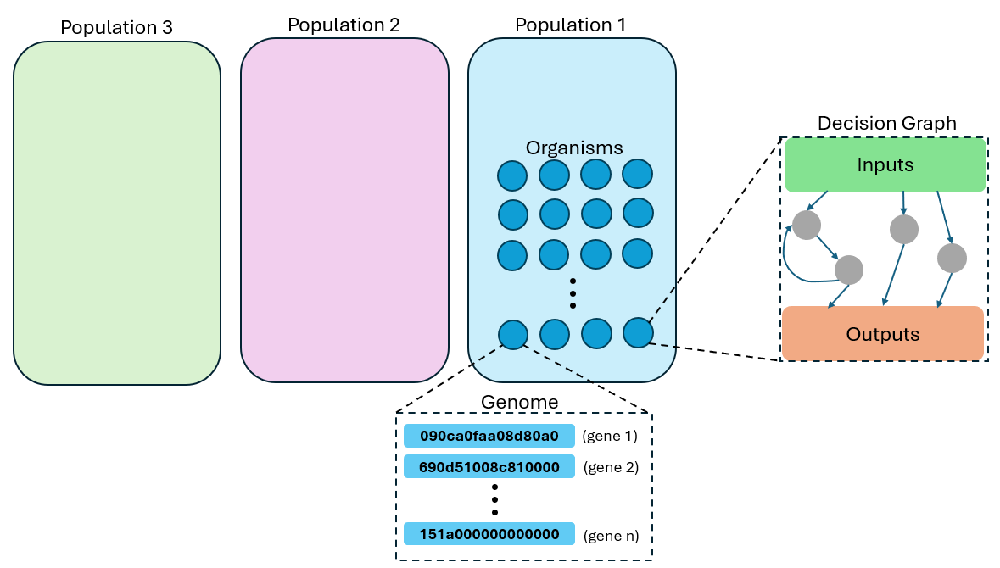
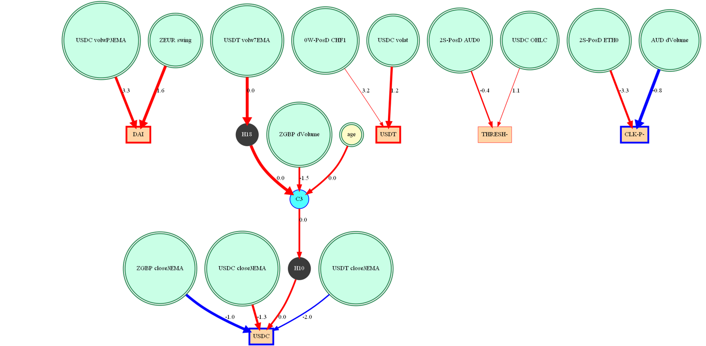
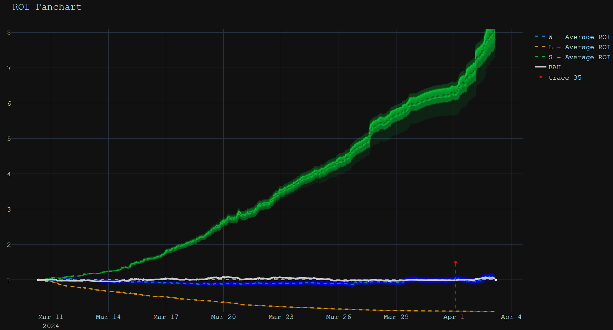
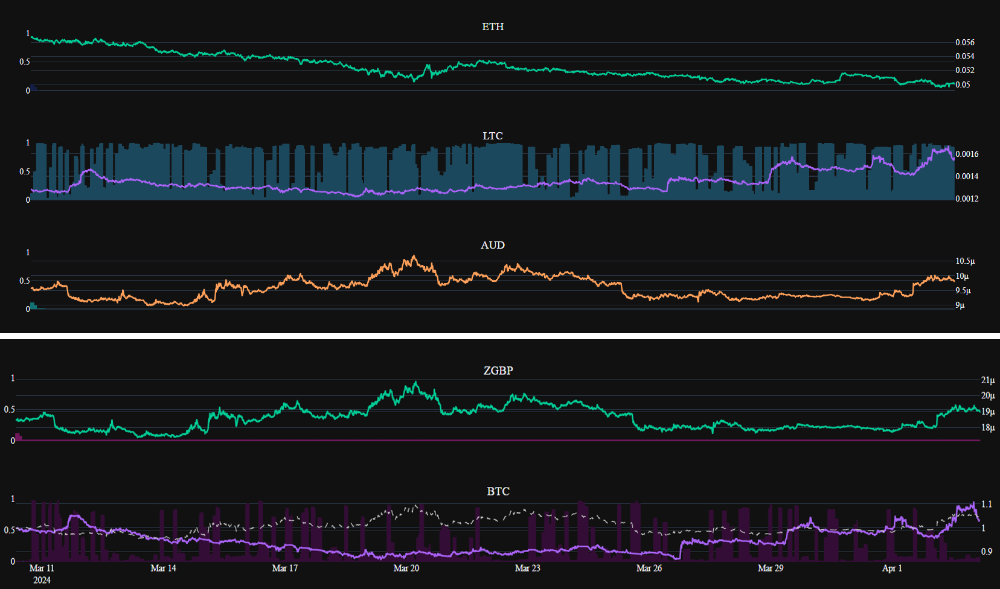

# MPGA-TimeSeries
Multi-population Genetic Algorithm-Based Model for time series prediction with a cryptocurrency trading sample project.

This is a proof-of-concept of MPGA. This multi-population genetic algorithm (life simulation) aims to model and forecast noisy/stochastic data (eg. crypto data) where traditional supervised/gradient methods may struggle.

MPGA uses numba for GPU acceleration but can also run on CPU.

# Running the Crypto Trader Demo
***Note: Use this model for trading at your own risk. After accounting for fees/spread, the model will typically arrive at an ROI close to 1 or perform worse than a buy-and-hold strategy. Using a model trained on the sample dataset for real trading will likely cause you to lose money. I include this only for educational purposes.***

1. Clone the repository
2. Download the [dataset file](https://drive.google.com/file/d/1UVCTGezruAlD53gvFBlbzm6fExKY0f1_/view?usp=sharing) and place in the "datasets/" folder.
3. Install requirements 
   >pip install -r requirements.txt
4. (Optional) Install pygraphvis (instructions at end of README)
5. Run training demo
   >python crypto_trader.py
6. Results will be stored in "outputs/"

# How MPGA Works

MPGA consists of one or more populations, each with one or more organisms. Each organism contains a small graph, or neural net, which controls the organism's actions based on external and internal inputs.

This example graph shows the decision network for a single organism. Inputs (green circles) connect through internal nodes (black/gray/blue circles) which then connect to outputs (squares).

There are multiple types of internal nodes:
1. **Simple hidden nodes**: store an activation signal for one time step and then propagate
2. **Conduit nodes**: propagate an activation signal instantaneously (during the same time step)
3. **Memory nodes**: Store and propagate signals but with a "store" control signal as a graph output to trigger overriding the stored signal

Each organism's properties, including its decision graph, is determined by a set of genes.

For example, an organism may have the following genes:

- **090ca0faa08d80a0**: Direct connection gene between nodes 202 and 250 with weight=2.0, bias=0.012
- **690d51008c810000**: Connection influence gene between nodes 213 and 256 with weight=0.78
- **4608d10dfe1f0001**: A random connection path gene between node 141 and 269 with weight=7.9
- **f6000000000000**: A latent/empty gene with no impact on behaviour
- **151a000000000000**: Set the internal clock period to 26
- **89c2000000000000**: Adjust the node decision threshold level to 0.76

Some nodes control a specific connection between two nodes (direct), while others (forward/backward influence, random path, reinforcement) control multiple connections from a single gene.

Genes can be mutated, skipped, duplicated, or deleted during genetic recombination.

## Communication
A theoretical benefit of this type of model is that, even though individual graphs are very simple/shallow, communication and interactions between organisms/populations enable more complex behaviours and pattern recognition.

Communication between organisms occur via:
- **Position density**: each organism can see the statistical distribution of positions across its population
- **Pheromone signals**: organisms can produce "pheromone" signals detectable by others as inputs

Communication between populations:
- **Cross-Population Position Density**: Organisms can view the statistical distribution of position of other populations.

Multiple populations can train simultaneously with differing or even competing fitness functions.

## Training
During training, a "generation" is simulated where a number of time steps are evaluated of all population/organism activity. At the end, the fitness of each organism is computed and a new populated is generated by:
1. using tournament selection to choose parents
2. recombining genes to produce a 'child' organism
3. decoding genes to build new decision graphs

## Example: Crypto Trading
In this example, MPGA is trained to forecast a dataset consisting of cryptocurrency data for 11 currencies:

>['ETH', 'LTC', 'AUD', 'CHF', 'DAI', 'USDC', 'USDT', 'ZUSD', 'ZCAD', 'ZEUR', 'ZGBP', 'BTC']

Input channels are based on various technicals (price moving average, volatility, volume) at 3-minute increments.

Each organism 'position' will be a normalized 11-element vector specifying a portfolio for this time step. The incremental ROI is computed at each time step.

Three populations are used with differing constrains/fitness criteria:
1. **Winner**: Organisms attempt to maximize the trading ROI across a generation. Trading fees and ask/bid spread is accounted for.
2. **Loser**: Organisms attempt to minimize the ROI across a generation (lose as much as possible). No trading fees/spread.
3. **Super**: Organisms attempt to maximize the trading ROI across a generation. Trading fees/spread ignored.

The "Winner" (W) population represents the desired behaviour for the trading model.

Each population contains 512 organisms, each with 32 genes.

Training on the sample dataset for 1000 generations with 500 steps per generation and using the first 1538 samples as 
training while reserving the last 1011 samples (~50 hours) for validation, the model achieved the following result:

Each population's ROI is computed by average the positions across all the contained organisms. The fanchart distribution also shows the distribution of ROIs across each population. 
- The green curve shows the **"super"** population (trading without fees and spread) which reaches an unrealistically high ROI of **>8**. 
- The orange curve shows the **"loser"** population which successfully achieves its goal of minimizing its ROI=**0.1**
- The blue curve is the **"winner"** population, aiming to maximize its ROI while constrained by trading fees and price spread. This population achieves an ROI of **1.06**
- The white line represents the **buy-and-hold** (BAH) baseline strategy which has an ROI of **1.04**

Looking at the traded positions for the W population, it has learned to trade only between LTC and BTC with minor positions in USD. This is likely due to the lower fees/spread for this pair.

A real-time trading model could conceivably be built by passing real-time market data to the model and taking the average positions of the W population and rebalancing a portfolio's positions accordingly.

# Installing GraphVis

To generate the graph plots, graphviz must be properly installed and configured. Use these instructions:

1. [Download](https://forum.graphviz.org/t/new-simplified-installation-procedure-on-windows/224) and install the appropriate graphviz for your OS. 
Make sure you set the system path

2. Install pygraphviz with pip:
>pip install --global-option=build_ext --global-option="-IC:\Program Files\Graphviz\include" --global-option="-LC:\Program Files\Graphviz\lib" pygraphviz
(change paths as needed)